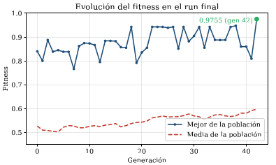

# MTG Deck Evolver

**Automatic competitive deck generation for _Magic: The Gathering_ (Standard) using a genetic algorithm, with fitness evaluated through real match simulation in the Forge engine.**


> Trabajo de Fin de Grado (TFG) — José Gascó Bule
> Grado en Tecnologías Interactivas · Escola Politècnica Superior de Gandia (UPV)
> Tutors: Juan Miguel Alberola Oltra · Víctor Sánchez Anguix

## About the project

MTG Deck Evolver is a genetic algorithm that builds competitive decks for the
**Standard** format of _Magic: The Gathering_ from scratch, without any prior
domain knowledge. It starts from a population of random decks and evolves them
under selection pressure until they resemble the decks a human would take to a
tournament. Instead of scoring decks with a static heuristic, the fitness of
each deck is measured by **playing real games** in the open-source
[Forge](https://github.com/Card-Forge/forge) engine.

Its main distinguishing feature is a set of **pack-aware operators**: mutation
and crossover work on _packs_ of four copies (the granularity at which a real
player reasons, following the four-copy rule) rather than on individual cards.
The fitness combines the win rate in a Swiss tournament (70%) with an
archetype-aware structural quality metric (30%), and a Hall of Fame with
per-archetype quotas preserves diversity across generations.

## Demo

Running `mtg_main.py` opens an interactive menu that drives the whole pipeline:

```text
MENÚ PRINCIPAL:
  1. Obtener cartas de Magic (Paso 1)
  2. Generar mazos iniciales (Paso 2)
  3. Ejecutar algoritmo genético (Pack-Aware + Gauntlet)
  4. Continuar desde checkpoint guardado
  5. Configurar Forge
  6. Analizar hardware del sistema
  7. Ver estadísticas del sistema
  8. Ejecución automática completa (pipeline cartas → mazos → algoritmo)
  9. Modo de prueba rápida
  10. Configurar modo headless
  11. Opciones avanzadas
  0. Salir

Selecciona una opción (0-11):
```

The orchestrator profiles your hardware, tunes the number of parallel workers,
and lets you run each stage or the full pipeline end to end.

### Fitness over a full run



*Best individual (noisy, blue) and population average (steady, red) across 43
generations of the final run. The peak of 0.9755 is reached in the last generation.*

## Requirements

- **Python 3.10+** with the dependencies listed in `requirements.txt`
  (`numpy`, `pandas`, `matplotlib`, `psutil`, `tqdm`, `requests`).
- **Java 21+** — required to run the Forge engine.
- **Forge** (match simulator) — a recent Forge desktop build. It is not bundled
  with this repository; see [Setting up Forge](#setting-up-forge).
- **Internet connection** — only the first time, to download the card catalog
  from the public [Scryfall](https://scryfall.com/docs/api) API.

## Installation

1. **Clone the repository**
   ```bash
   git clone https://github.com/JGasBul/TFGJoseGascoBule.git
   cd TFGJoseGascoBule
   ```

2. **Install the Python dependencies** (a virtual environment is recommended)
   ```bash
   python3 -m venv .venv
   source .venv/bin/activate        # Windows: .venv\Scripts\activate
   pip install -r requirements.txt
   ```

3. **Set up Forge** — see below.

### Setting up Forge

MTG Deck Evolver runs on top of a local Forge installation, and **Forge and the
project files must share the same folder** — the algorithm scripts live alongside
the Forge files. It does not matter whether you drop the project into the Forge
folder or extract Forge into the project folder; what matters is that they end up
together. **Any recent Forge desktop build works — the newer, the better.**

1. Download the full Forge **desktop** distribution from the
   [Forge releases page](https://github.com/Card-Forge/forge/releases).
2. Extract it so that the Forge files (the `.jar`, the `res/` folder, …) sit in the
   same folder as `mtg_main.py`.
3. **Run Forge once** so it generates all of its runtime files and dependencies.
4. If a **mobile** build is also present, delete its JAR
   (`forge-gui-mobile-dev-*.jar`); otherwise the system may pick it up instead of
   the desktop build.
5. From the main menu, choose **option 5 – Configurar Forge** to auto-detect the
   JAR or set its path manually.

Make sure **Java 21+** is installed and on your `PATH` (`java -version`).

## Usage

Everything runs through the interactive orchestrator:

```bash
python3 mtg_main.py
```

A typical first run follows the menu in order:

1. **Get the cards** (option 1) — downloads the Standard-legal cards from Scryfall
   and builds the catalog (`mtg_data/card_catalog.json`) and indices
   (`mtg_data/card_indices.json`). Only needed once.
2. **Generate the initial decks** (option 2) — builds the starting population.
3. **Run the genetic algorithm** (option 3) — evolves the population, evaluating
   each deck through real Forge matches.

Or run the whole thing end to end with **option 8 – Ejecución automática completa**
(cards → decks → evolution).

Evolved decks are written to `mtg_evolved_decks/`, and a checkpoint is saved
after every generation, so an interrupted run can be resumed later (option 4).

## How it works

- **Representation.** Each deck is an integer vector over the ~4,130-card Standard
  catalog, where each position holds the number of copies of a card. The four-copy
  rule is encoded directly in the representation.
- **Pack-aware operators.** Mutation and crossover work on *packs* of four copies,
  mirroring how a human builder reasons ("including a card" means "including four
  copies") instead of editing individual cards. This is the project's central
  contribution.
- **Fitness = 0.7 · win rate + 0.3 · quality.** The win rate comes from real games;
  the quality term is an archetype-aware structural score
  (0.35 synergy + 0.35 category balance + 0.30 archetype coherence).
- **Swiss tournament.** Decks are paired with a Swiss system whose number of games
  grows roughly linearly with the population, keeping real-match evaluation
  affordable.
- **Hall of Fame.** An elite archive with per-archetype quotas preserves diversity
  and prevents a single archetype from taking over the population.
- **Forge as fitness oracle.** Every matchup is played out by Forge's AI, so decks
  are judged by real game outcomes rather than a static heuristic.

For the full design, experiments and analysis, see the thesis in `memoria/`.

> **Note on reproducibility.** Runs are not reproducible. Beyond the fact that the
> evolution is not seeded, the fitness itself is **stochastic**: it is measured by
> playing real games in Forge, whose outcome depends on the random opening hands and
> on the engine AI's decisions. Two runs therefore diverge even from an identical
> starting population. The `experimentos/` folder keeps the recorded runs
> (configuration, populations, statistics and logs) behind the results discussed in
> the thesis.

## Project structure

```text
.
├── mtg_main.py                 # Interactive orchestrator (entry point)
├── obtener_cartas_mtg.py       # Step 1 — download the card catalog from Scryfall
├── generador_mazos_mtg.py      # Step 2 — build the initial deck population
├── algoritmo_genetico_mtg.py   # Core — MTGGeneticAlgorithm (full evolutionary loop)
├── requirements.txt
│
├── tests/                      # Ad-hoc validation scripts written during development (not a formal unit-test suite)
├── experimentos/               # Recorded experiment runs (exp01–exp08): config, populations, stats, logs
├── analisis/                   # Analysis scripts (e.g. quality-metric refinement)
├── gauntlet/tier1/             # Tier-1 metagame anchor decks used to probe the gauntlet
├── memoria/                    # Full thesis (LaTeX source + compiled PDF)
├── documentacion/              # Development notes and intermediate analyses
├── docs/img/                   # Images used in this README
│
├── mtg_data/                   # Card catalog and indices (generated on first run)
├── mtg_decks/                  # Initial deck population (generated)
└── mtg_evolved_decks/          # Evolved decks and champions (output)
```

## Thesis & documentation

The full TFG (in Spanish) describing the design, experiments and
analysis behind this project is in [`memoria/`](memoria/) — both the LaTeX source
and the compiled PDF. Additional development notes and intermediate analyses are in
[`documentacion/`](documentacion/).

## Author

**José Gascó Bule** — TFG, Grado en Tecnologías Interactivas,
Escola Politècnica Superior de Gandia (Universitat Politècnica de València), 2026.
Tutors: Juan Miguel Alberola Oltra · Víctor Sánchez Anguix.

> If you reference this work:
> Gascó Bule, J. (2026). *Diseño e implementación de metaheurística para el problema
> de la generación de mazos en Magic: The Gathering* [Trabajo de Fin de Grado]. Universitat
> Politècnica de València.

## License

The **code** in this repository is not yet released under an open-source license,
so all rights are reserved for now — an open-source license may be added later. The
**thesis** in [`memoria/`](memoria/) is licensed under Creative Commons
Attribution–NonCommercial–NoDerivatives (CC BY-NC-ND) through the university
repository (RiuNet).
